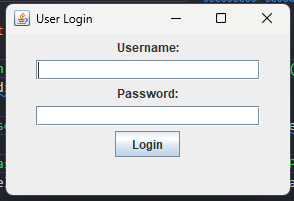
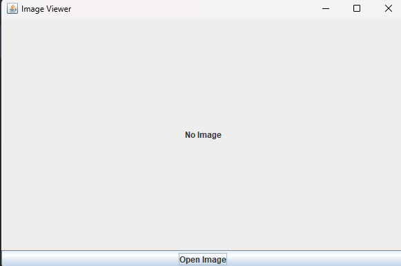

# **Tugas Week 14 PBO**

**Nama** : Adyuta Prajahita Murdianto

**NRP** : 5025221186

**Kelas** : PBO A

# **LoginFrame**

## **Class LoginFrame**

```java
import javax.swing.*;
import java.awt.*;
import java.awt.event.*;

public class LoginFrame extends JFrame {

  private JLabel userLabel, passwordLabel;
  private JTextField userTextField;
  private JPasswordField passwordField;
  private JButton loginButton;

  public LoginFrame() {
    setTitle("User Login");
    setLayout(new FlowLayout());
    setSize(300, 200);
    setDefaultCloseOperation(JFrame.EXIT_ON_CLOSE);

    userLabel = new JLabel("Username:");
    userTextField = new JTextField(20);

    passwordLabel = new JLabel("Password:");
    passwordField = new JPasswordField(20);

    loginButton = new JButton("Login");

    loginButton.addActionListener(new ActionListener() {
      @Override
      public void actionPerformed(ActionEvent e) {
        String username = userTextField.getText();
        String password = new String(passwordField.getPassword());

        if (username.equals("admin") && password.equals("password")) {
          JOptionPane.showMessageDialog(null, "Login Successful");
        } else {
          JOptionPane.showMessageDialog(null, "Invalid Username or Password");
        }
      }
    });

    add(userLabel);
    add(userTextField);
    add(passwordLabel);
    add(passwordField);
    add(loginButton);
  }
}
```

Class `LoginFrame` adalah JFrame (window) yang menampilkan form login untuk aplikasi. Class ini mengatur layout, komponen GUI, dan logika untuk memverifikasi login pengguna.

### **1. Atribut**

- **userLabel**

  `JLabel` yang menampilkan teks "Username:".
  
- **passwordLabel**

  `JLabel` yang menampilkan teks "Password:".
  
- **userTextField**

  `JTextField` yang digunakan untuk memasukkan nama pengguna (username).
  
- **passwordField**

  `JPasswordField` yang digunakan untuk memasukkan kata sandi (password).
  
- **loginButton**

  `JButton` yang ketika diklik akan memeriksa kredensial login.

### **2. Konstruktor `LoginFrame()`**

- `setTitle("User Login")`: Memberikan judul pada jendela aplikasi (frame).

- `setLayout(new FlowLayout())`: Mengatur layout manager untuk frame menggunakan FlowLayout, yang secara otomatis mengatur posisi komponen secara berurutan (flow).
  
- `setSize(300, 200)`: Mengatur ukuran window (frame) menjadi 300 piksel lebar dan 200 piksel tinggi.
  
- `setDefaultCloseOperation(JFrame.EXIT_ON_CLOSE)`: Mengatur perilaku jendela ketika ditutup, dalam hal ini aplikasi akan keluar saat jendela ditutup.
  
- `userLabel = new JLabel("Username:") dan passwordLabel = new JLabel("Password:")`: Membuat label teks untuk username dan password.
  
- `userTextField = new JTextField(20)`: Membuat JTextField untuk input username, dengan lebar 20 kolom.

- `passwordField = new JPasswordField(20)`: Membuat JPasswordField untuk input password, juga dengan lebar 20 kolom.
  
- `loginButton = new JButton("Login")`: Membuat tombol login dengan teks "Login".

### **3. Event Listener**

- `loginButton.addActionListener(new ActionListener() { ... })`: Menambahkan aksi yang akan dilakukan saat tombol login diklik. Dalam hal ini:

  - `String username = userTextField.getText();`: Mengambil teks dari field username.
  
  - `String password = new String(passwordField.getPassword());`: Mengambil password sebagai string dari JPasswordField (karena password disimpan sebagai array char, kita mengkonversinya ke string).

  - `if (username.equals("admin") && password.equals("password"))`: Mengecek apakah username dan password sesuai dengan nilai yang telah ditentukan ("admin" dan "password").

    - Jika benar, menampilkan pesan `Login Successful` menggunakan `JOptionPane.showMessageDialog()`.
  
    - Jika salah, menampilkan pesan `Invalid Username or Password`.

### **4. Menambahkan Komponen ke Frame**

- `add(userLabel)`: Menambahkan label username ke frame.

- `add(userTextField)`: Menambahkan text field untuk username ke frame.

- `add(passwordLabel)`: Menambahkan label password ke frame.

- `add(passwordField)`: Menambahkan text field untuk password ke frame.

- `add(loginButton)`: Menambahkan tombol login ke frame.

## **Class Main**

```java
import javax.swing.*;

public class Main {
  public static void main(String[] args) {
    SwingUtilities.invokeLater(new Runnable() {
      @Override
      public void run() {
        new LoginFrame().setVisible(true);
      }
    });
  }
}
```

Class `Main` adalah titik masuk utama untuk menjalankan aplikasi Swing. Kelas ini digunakan untuk menampilkan LoginFrame ketika aplikasi dijalankan.

### **1. Method `main`**

- Method ini adalah titik awal dari aplikasi Java, yang dijalankan pertama kali.

- `SwingUtilities.invokeLater()` memastikan bahwa antarmuka pengguna (GUI) dijalankan di thread yang tepat (thread event dispatching). Ini adalah cara yang benar untuk membuat dan menampilkan komponen GUI di Swing, karena Swing tidak aman untuk digunakan di banyak thread secara bersamaan.

- `new LoginFrame().setVisible(true);`: Membuat objek `LoginFrame` dan menampilkan window login dengan memanggil `setVisible(true)`.

## **Hasil**



# **ImageViewer**

```java
import javax.swing.*;
import java.awt.*;
import java.awt.event.*;
import java.io.*;
import javax.imageio.ImageIO;
import java.awt.image.BufferedImage;

public class ImageViewer extends JFrame {

  private JLabel imageLabel;
  private JButton openButton;

  public ImageViewer() {
    setTitle("Image Viewer");
    setSize(600, 400);
    setDefaultCloseOperation(JFrame.EXIT_ON_CLOSE);
    setLayout(new BorderLayout());

    imageLabel = new JLabel("No Image", JLabel.CENTER);
    imageLabel.setPreferredSize(new Dimension(600, 300));

    openButton = new JButton("Open Image");

    openButton.addActionListener(new ActionListener() {
      @Override
      public void actionPerformed(ActionEvent e) {
        openImage();
      }
    });

    add(imageLabel, BorderLayout.CENTER);
    add(openButton, BorderLayout.SOUTH);
  }

  private void openImage() {
    JFileChooser fileChooser = new JFileChooser();
    fileChooser.setDialogTitle("Open Image");

    fileChooser
        .setFileFilter(new javax.swing.filechooser.FileNameExtensionFilter("Image Files", "jpg", "jpeg", "png", "gif"));

    int result = fileChooser.showOpenDialog(this);

    if (result == JFileChooser.APPROVE_OPTION) {
      File selectedFile = fileChooser.getSelectedFile();
      try {
        BufferedImage img = ImageIO.read(selectedFile);
        ImageIcon imageIcon = new ImageIcon(img);
        imageLabel.setIcon(imageIcon);
        imageLabel.setText(""); 
      } catch (IOException ex) {
        JOptionPane.showMessageDialog(this, "Error loading image", "Error", JOptionPane.ERROR_MESSAGE);
      }
    }
  }
}
```

## **Class ImageViewer**

Class `ImageViewer` adalah JFrame (window) yang berfungsi sebagai viewer untuk menampilkan gambar yang dipilih oleh pengguna.

### **1. Atribut**

- **imageLabel**

  `JLabel` yang digunakan untuk menampilkan gambar atau teks "No Image" jika tidak ada gambar yang dipilih.

- **openButton**

  `JButton` yang memungkinkan pengguna untuk membuka gambar dengan memilihnya melalui file dialog.

### **2. Konstruktor `ImageViewer()`**

- `setTitle("Image Viewer")`: Memberikan judul pada jendela (frame) menjadi "Image Viewer".

- `setSize(600, 400)`: Menetapkan ukuran jendela menjadi 600x400 piksel.

- `setDefaultCloseOperation(JFrame.EXIT_ON_CLOSE)`: Menetapkan operasi default ketika jendela ditutup (aplikasi akan keluar).

- `setLayout(new BorderLayout())`: Mengatur layout frame menggunakan `BorderLayout`, di mana komponen akan diatur dalam lima bagian (CENTER, NORTH, SOUTH, EAST, WEST).

### **3. Komponen**

- `imageLabel = new JLabel("No Image", JLabel.CENTER)`: Membuat sebuah label yang berfungsi untuk menampilkan gambar, dan jika tidak ada gambar, akan menampilkan teks "No Image" di tengah.

- `imageLabel.setPreferredSize(new Dimension(600, 300))`: Mengatur ukuran preferensi label gambar menjadi 600x300 piksel.

- `openButton = new JButton("Open Image")`: Membuat sebuah tombol yang diberi teks "Open Image" untuk membuka dialog pemilihan file gambar.

### **4. Event Listener**

`openButton.addActionListener(new ActionListener() {...})`: Menambahkan aksi untuk tombol "Open Image" yang akan memanggil metode `openImage()` ketika tombol diklik.

### **5. Method `openImage()`**

Metode ini digunakan untuk membuka file gambar melalui `JFileChooser` dan menampilkannya di dalam `imageLabel`.

**Langkah-langkah dalam `openImage()`:**

- `JFileChooser fileChooser = new JFileChooser();`: Membuat objek `JFileChooser`, yang akan digunakan untuk memilih file gambar.

- `fileChooser.setDialogTitle("Open Image");`: Mengatur judul dialog pemilihan file menjadi "Open Image".

- `fileChooser.setFileFilter(new javax.swing.filechooser.FileNameExtensionFilter("Image Files", "jpg", "jpeg", "png", "gif"));`: Menetapkan filter file untuk hanya menampilkan file gambar dengan ekstensi `jpg`, `jpeg`, `png`, atau `gif`.

- `int result = fileChooser.showOpenDialog(this);`: Menampilkan dialog untuk memilih file, dan menyimpan hasilnya dalam variabel `result`.

  - Jika pengguna memilih file dan menekan "OK" (`JFileChooser.APPROVE_OPTION`), maka:

    - `File selectedFile = fileChooser.getSelectedFile();`: Mengambil file yang dipilih oleh pengguna.

    - `BufferedImage img = ImageIO.read(selectedFile);`: Membaca gambar dari file yang dipilih menggunakan `ImageIO.read()`. Ini menghasilkan objek `BufferedImage` yang mewakili gambar.

    - `ImageIcon imageIcon = new ImageIcon(img);`: Mengonversi `BufferedImage` menjadi `ImageIcon`, yang dapat ditampilkan di komponen GUI seperti `JLabel`.

    - `imageLabel.setIcon(imageIcon);`: Menampilkan gambar pada `imageLabel` dengan mengatur ikon gambar.

    - `imageLabel.setText("");`: Menghapus teks "No Image" setelah gambar berhasil dimuat.

  - Jika terjadi kesalahan saat membuka gambar, maka `JOptionPane.showMessageDialog()` akan menampilkan pesan kesalahan kepada pengguna.
  
## **Class Main**

```java
import javax.swing.SwingUtilities; 

public class Main {
  public static void main(String[] args) {
    // Menjalankan aplikasi ImageViewer
    SwingUtilities.invokeLater(new Runnable() {
      @Override
      public void run() {
        new ImageViewer().setVisible(true);
      }
    });
  }
}
```

Class `Main` adalah titik awal aplikasi yang menjalankan `ImageViewer`.

### **1. Method `main`**

- `SwingUtilities.invokeLater(new Runnable() {...})`: Ini memastikan bahwa ImageViewer dijalankan di event dispatch thread.

- `new ImageViewer().setVisible(true);`: Membuat objek `ImageViewer` dan menampilkan jendela aplikasi.

## **Hasil**

